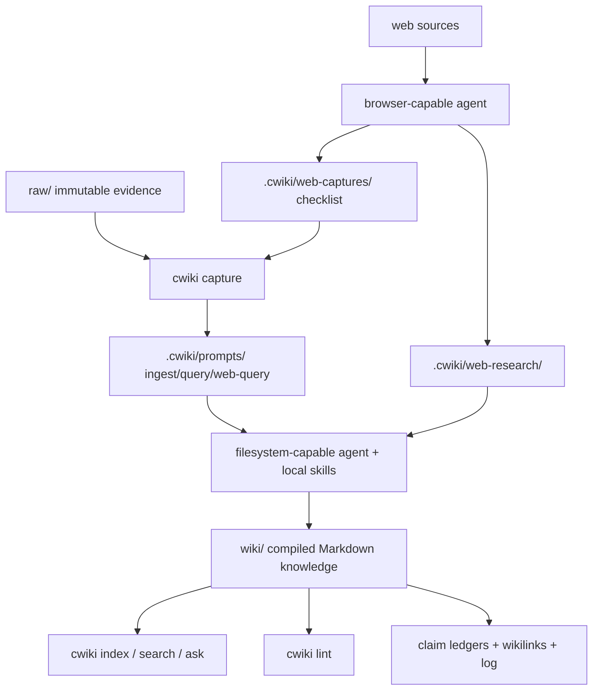

# LLM Compound Wiki

[中文说明](README.zh-CN.md)

LLM Compound Wiki is an open-source scaffold for building a personal or team wiki that an AI agent continuously maintains.

Build an agent-maintained Markdown wiki in any folder.

Default path: no database, no embedding service, no vendor lock-in. Larger wikis can add an optional embedding/vector index later.

Use Codex, Claude Code, Cursor, Trae, OpenCode, or any filesystem-capable agent.

It is inspired by Andrej Karpathy's `llm-wiki` prototype and existing community experiments, but this project takes a slightly different shape:

- agent-agnostic first: Codex, Claude Code, OpenCode, Cursor, or any filesystem-capable agent can use it
- Obsidian-friendly markdown by default
- zero-dependency Python CLI for repeatable initialization, indexing, search, and health checks
- explicit distinction between raw evidence and the LLM-owned compiled wiki layer

## Core Idea

Most RAG systems rediscover your source material on every query. A compound wiki does more of the work once.

When you add a source, the agent reads it, extracts durable claims, updates related pages, adds backlinks, flags contradictions, updates the index, and appends to a log. The wiki becomes a persistent compiled artifact, not a transient chat answer.

```text
raw/ source material
        |
        v
LLM agent reads, reconciles, links, cites
        |
        v
wiki/ summaries, entities, concepts, comparisons, overview, synthesis
```



## Execution Model

LLM Compound Wiki separates the deterministic local tool layer from the intelligent agent layer.

- The CLI is the scaffold and local utility layer: initialize a wiki, capture sources, rebuild indexes, lint health, search local pages, and generate auditable prompts or briefs.
- The generated wiki folder is the agent workspace. Agents should read `AGENTS.md`, `CLAUDE.md`, `WIKI_SCHEMA.md`, and the local skills before changing `wiki/`.
- The copied skill files are instructions for agents, not executable CLI plugins.
- `ask` and `web-ask` prepare evidence and prompts; they do not call an LLM.
- `answer` calls the `.env` configured model, but only against local wiki retrieval.
- Live web research currently requires a browser-capable agent following `wiki-agent-browser`.

## Feature Positioning

| Capability | LLM Compound Wiki |
|---|---|
| Agent-agnostic workflow | Yes |
| Obsidian-friendly Markdown | Yes |
| Zero-dependency Python CLI | Yes |
| Default local search without embeddings | Yes |
| Optional embedding/vector index | Planned extension |
| Claim ledger and operation log | Yes |
| Generated agent skills | Yes |
| Hosted service | No |
| Vector database required | No |
| CLI live web browsing | Not yet |
| Fully autonomous crawler | No |

## What This Is Not

- Not a hosted knowledge-base app.
- Not a hosted vector database or mandatory embedding service.
- Not an autonomous crawler that silently rewrites your wiki.
- Not tied to one model provider, editor, or agent platform.
- Not a replacement for human judgment about which sources deserve to become durable knowledge.

## Repository Layout

```text
.
├── AGENTS.md                 Agent rules for this project
├── bin/cwiki.py              Zero-dependency Python CLI
├── bin/cwiki.mjs             Node/npm compatibility wrapper
├── templates/                Files copied into a new wiki
│   ├── AGENTS.md
│   ├── AGENTS.zh-CN.md
│   ├── CLAUDE.md
│   ├── CLAUDE.zh-CN.md
│   ├── WIKI_SCHEMA.md
│   ├── .claude/skills/       Canonical skill definitions
│   └── .agents/skills/       Compatibility skill entrypoints
├── raw/                      Private immutable sources, ignored by git
├── .cwiki/prompts/           Generated ingest prompts, ignored by git
├── .cwiki/usage/             Local LLM usage ledger, ignored by git
├── wiki/
│   ├── overview.md           Durable map of the knowledge base
│   ├── synthesis.md          Current integrated thesis
│   ├── summaries/            Source and topic summaries
│   ├── entities/             People, organizations, products, projects
│   ├── concepts/             Ideas, theories, methods, terms
│   ├── comparisons/          Compare/contrast and decision pages
│   ├── index.md              Content catalog
│   └── log.md                Append-only operation log
```

## Quick Start

### 1. Clone

```bash
git clone https://github.com/Forever5471/llm-compound-wiki.git
cd llm-compound-wiki
```

### 2. Create a Wiki

Use the Python CLI directly from the checkout:

```bash
python3 ./bin/cwiki.py init ./my-wiki --domain "AI research notes"
cd my-wiki
python3 ../bin/cwiki.py lint .
```

This creates a wiki with `raw/`, `wiki/`, `.cwiki/prompts/`, `CLAUDE.md`, `CLAUDE.zh-CN.md`, `AGENTS.md`, `AGENTS.zh-CN.md`, `WIKI_SCHEMA.md`, `.env.example`, and workflow skills.

### 3. Add Sources

Put source files under `my-wiki/raw/`, or capture a URL/file:

```bash
python3 ../bin/cwiki.py capture . https://example.com/article --title "Example Article"
python3 ../bin/cwiki.py capture . ./notes.md --title "Project Notes"
python3 ../bin/cwiki.py capture . ./product-plan.docx --title "Product Plan"
python3 ../bin/cwiki.py capture . ./intro-deck.pptx --title "Intro Deck"
python3 ../bin/cwiki.py capture . ./metrics.xlsx --title "Metrics"
```

`capture` writes immutable source records under `raw/captures/` and creates ingest prompts under `.cwiki/prompts/`. It has built-in support for URL records, UTF-8 text/Markdown, OOXML text extraction for `.docx`, `.pptx`, and `.xlsx`, and image file references. For `.pdf`, it uses the local `pdftotext` command when available; otherwise it asks you to convert the PDF to UTF-8 text or route scanned pages through the image/OCR workflow.

For complex formats, use the project's built-in parser skills: `wiki-parse-docx`, `wiki-parse-pdf`, `wiki-parse-image`, `wiki-parse-pptx`, and `wiki-parse-xlsx`. This project does not automatically search GitHub or integrate external parser projects. If the built-in extraction is not good enough, convert the original file to Markdown or UTF-8 text with a tool of your choice, then use this project for capture, ingest, ask, and answer.

Ingest preserves the source language by default: Chinese sources should produce Chinese wiki pages, English sources should produce English wiki pages. Translation only happens when the user explicitly asks for it.

### 4. Ask an Agent to Ingest

Open the generated wiki folder in Codex, Claude Code, OpenCode, Cursor, or another filesystem-capable agent, then ask:

```text
Read CLAUDE.md and WIKI_SCHEMA.md, then process .cwiki/prompts/ingest-xxx.md.
```

The agent should compile the source into:

```text
wiki/
├── overview.md
├── synthesis.md
├── summaries/
├── entities/
├── concepts/
├── comparisons/
├── index.md
└── log.md
```

### Overview vs Synthesis

New wikis include two non-placeholder first reading surfaces:

- `wiki/overview.md` is the early-stage entry point. It maps the domain, important page clusters, navigation paths, and open map questions.
- `wiki/synthesis.md` becomes the entry point when the wiki has enough source-backed material for an integrated thesis. It records stable claims, tensions, contradictions, and update triggers.

Use one as the first screen depending on wiki maturity: start with `overview.md` while sources are sparse; start with `synthesis.md` when cross-page evidence supports a durable conclusion. Keep both pages short and useful, and avoid duplicating `wiki/index.md`. Every ingest or update should refresh both files: `overview.md` gets the current map and entry links; `synthesis.md` gets the current thesis state, contradictions, evidence inventory, or an explicit note that no thesis has been promoted yet.

### 5. Maintain and Search

```bash
python3 ../bin/cwiki.py index .
python3 ../bin/cwiki.py lint .
python3 ../bin/cwiki.py search . "retrieval"
python3 ../bin/cwiki.py ask . "What does this wiki know about retrieval?"
python3 ../bin/cwiki.py web-ask . "What changed recently about this topic?" --wiki-weight 0.6 --web-weight 0.4
OPENAI_API_KEY=... python3 ../bin/cwiki.py answer . "What does this wiki know about retrieval?"
```

## Optional npm Wrapper

If you still want an npm-style command, install from this checkout; the npm entrypoint simply delegates to Python:

```bash
npm install -g .
cwiki init ./my-wiki --domain "Market research"
cwiki search ./my-wiki "pricing"
cwiki lint ./my-wiki
```

The repository keeps a small `bin/cwiki.mjs` Node wrapper for npm compatibility. The actual implementation lives in `bin/cwiki.py`.

Requirements:

- Python 3.10+
- Node/npm only if you want the optional global `cwiki` wrapper

## CLI Commands

```bash
cwiki init <dir> [--domain "..."]
cwiki index <dir>
cwiki lint <dir>
cwiki link-graph <dir>        # graph is kept as a compatibility alias
cwiki link-graph-report <dir> # graph-report is kept as a compatibility alias
cwiki path <dir> <from-slug-or-title> <to-slug-or-title>
cwiki explain <dir> <slug-or-title>
cwiki search <dir> <query>
cwiki ask <dir> <question> [--top-k 6] [--retrieval auto|direct|graph|path|synthesis] [--graph-rerank] [--show-context]
cwiki web-ask <dir> <question> [--top-k 6] [--max-web-sources 6] [--wiki-weight 0.6] [--web-weight 0.4] [--no-web] [--show-context]
cwiki answer <dir> <question> [--provider openai|glm] [--model "..."] [--top-k 6] [--retrieval auto|direct|graph|path|synthesis] [--graph-rerank] [--web-on-gaps]
cwiki eval <dir> [--output <file>] [--no-write] [--json]
cwiki eval-answer <dir> <answer-file> [--output <file>] [--no-write] [--json] [--llm] [--web-on-gaps]
cwiki eval-all <dir> [--answer <answer-file>] [--wiki-only] [--output <file>] [--no-write] [--json]
cwiki eval-schedule <dir> --every-days 7 [--llm] [--run-if-due]
cwiki usage-report <dir> [--operation answer] [--artifact <path>] [--question "..."] [--json]
cwiki usage-log <dir> --operation ingest --provider agent-platform --model current-agent-model --input-tokens 1000 --output-tokens 500
cwiki status <dir>
cwiki ingest-plan <dir> [--source <raw-file>] [--prompt <prompt-file>] [--run-id <id>]
cwiki ingest-status <dir> [run]
cwiki ingest-step <dir> [run] <step> --status pending|in_progress|completed|blocked [--note "..."]
cwiki capture <dir> <file-or-url> [--title "..."]
```

`capture` does not summarize by itself. It creates a raw-source record and an ingest prompt for your agent. The agent then follows `WIKI_SCHEMA.md` and the skill files to compile the source into the right `wiki/` sections.

`ingest-plan` creates a recoverable ingest run under `.cwiki/ingest-runs/`. Use `status` or `ingest-status` to see the latest run, and `ingest-step` to mark progress through `status -> ingest-plan -> apply -> validate -> index -> link-graph -> eval`. This does not replace the agent-owned wiki writing step; it gives the workflow a deterministic state file so a run can resume after interruption.

`ask` does not call an LLM by default. It uses hybrid retrieval over the compiled wiki: keyword retrieval for exact matches, lightweight local hash-vector retrieval to reduce synonym and long-document misses, and relationship retrieval over `[[wikilink]]` neighbors. It then writes a model-oriented query prompt under `.cwiki/prompts/` and a human-readable evidence brief under `.cwiki/briefs/`. The brief is useful for quick inspection; hand the prompt to Codex, Claude Code, or another agent for a polished answer. Add `--graph-rerank` only when you want the configured model to semantically rerank graph/path/synthesis retrieval candidates before the prompt is written.

The lightweight vector retrieval is not an embedding API. It tokenizes local Markdown, hashes tokens into a fixed-size vector, and ranks pages with cosine similarity plus keyword and link-graph boosts. It is zero-dependency and deterministic, but less semantically powerful than model embeddings. For medium or large wikis, the intended extension path is an optional embedding/vector coarse-retrieval layer before the existing wiki and link-graph ranking.

For agent-platform Q&A, use the hybrid query workflow. Start with `cwiki ask` so the question has a reproducible evidence prompt and brief. The agent should read those artifacts and the listed wiki pages first; if the prompt is incomplete, it may search the wiki again, inspect adjacent pages, and follow one level of useful `[[wikilinks]]`. Final prose should still follow the project answer protocol: `## Evidence Used`, `## Answer`, and `## Gaps`, with `[[slug]]` citations and source paths or URLs near factual claims. If current web evidence is needed, switch to `cwiki web-ask` and `wiki-agent-browser` rather than relying on model memory.

See [docs/answering-workflow.md](docs/answering-workflow.md) for the full answering workflow.

`link-graph` and `link-graph-report` generate the current link graph from compiled wiki frontmatter, claim ledgers, and `[[wikilinks]]`. The older `graph` and `graph-report` commands are compatibility aliases. This is a wikilink navigation graph, not a typed knowledge graph or semantic entity-relation graph. Phase 1 does not call an LLM and does not read raw source bodies: pages are nodes, wikilinks are edges, and outputs are `.cwiki/graph/graph.json` plus `.cwiki/graph/graph.md`. `path` finds the shortest undirected wikilink path between two pages, and `explain` prints one page's inbound links, outbound links, claim sources, and graph degree.

`ask --retrieval auto|direct|graph|path|synthesis` uses this layer to record a Retrieval Trace in query prompts:

- `direct`: direct keyword/vector hits for narrow fact lookup.
- `graph`: direct hits plus inbound/outbound wikilink neighbors for nearby concepts, roles, modules, and entities.
- `path`: graph context plus shortest-path evidence for workflows, mechanisms, dependencies, relationships, and how/why questions.
- `synthesis`: direct, graph, path, overview/synthesis, and central-node context for broad summaries, comparisons, tradeoffs, strategy, and evaluation.
- `auto`: CLI-selected layer. If `auto` selects `path` but finds no path evidence, it falls back to `graph` and records the fallback in Retrieval Trace.

With `--graph-rerank`, the CLI sends final context candidate titles, summaries, retrieval roles, and neighbor/path reasons to the configured model and asks for strict JSON ranking. The rerank status, selected reasons, and gaps are written into Retrieval Trace; `answer --graph-rerank` then sends the reranked Context Pack to the final answer model. GLM graph rerank sends `thinking: disabled` by default so output tokens go to strict JSON; set `CWIKI_GRAPH_RERANK_THINKING=enabled` if you want reasoning-enabled rerank.

`web-ask` is for questions that need local wiki context plus current web evidence. It first retrieves local wiki pages, then writes four artifacts: `.cwiki/prompts/web-query-*.md` for browser research, `.cwiki/web-research/web-research-*.md` for recording web findings, `.cwiki/web-captures/web-captures-*.md` for deciding which web sources must become durable `raw/captures/` records, and `.cwiki/prompts/fusion-*.md` for a later agent to synthesize local wiki evidence with web evidence into the final answer. Default weights are local wiki `0.6` and web search `0.4`; tune them with `--wiki-weight` and `--web-weight`. Use `--web-weight 0` or `--no-web` to disable browsing and produce a local-wiki-only fusion prompt.

When an answer or evaluation says that the current response lacks external evidence, add `--web-on-gaps` to `cwiki answer` or `cwiki eval-answer`. The CLI scans the answer `## Gaps`, deterministic warnings, and optional LLM-assisted evaluation text for signals such as missing case studies, quantitative metrics, current evidence, or migration guidance. If triggered, it creates the same browser workflow artifacts plus `.cwiki/web-gaps/web-gap-*.md`. The follow-up respects `CWIKI_WEB_*` defaults; override them with `--web-gap-max-sources`, `--web-gap-wiki-weight`, and `--web-gap-web-weight`.

The CLI does not browse the live web by itself in the current implementation. The skills copied into `.claude/skills/` and `.agents/skills/` are agent instructions, not executable CLI plugins. Give the generated `web-query-*.md` prompt to a browser-capable agent that can use `wiki-agent-browser`; that agent should search, open sources, write `.cwiki/web-research/*.md`, update `.cwiki/web-captures/*.md`, and then answer from the generated fusion prompt.

A future terminal-only `web-answer` flow could combine wiki retrieval, live web search, configured evidence weights, and the `.env` model provider in one command, but that is not implemented yet.

A browser-capable agent using `wiki-agent-browser` should read the local wiki first, search the web when enabled, open source pages before citing them, and record results under `.cwiki/web-research/`. It should also update `.cwiki/web-captures/` so important web sources can be captured into `raw/captures/`. Final answers should separate local evidence, web evidence, synthesis, and gaps. Every external factual claim needs an exact URL and access date. Durable web sources should be recorded with `cwiki capture . <url> --title "<title>"` before they are ingested into `wiki/`.

`answer` calls a model and writes the draft answer under `.cwiki/answers/`. It currently supports OpenAI's Responses API and GLM through an OpenAI-compatible Chat Completions endpoint. It still creates the same query prompt and human brief first, so answers remain auditable. Draft answers are not written into `wiki/` automatically; review them before asking an agent to preserve useful synthesis in the compiled wiki layer.

`eval`, `eval-answer`, and `eval-all` generate quality reports under `.cwiki/eval/`. They always include deterministic local checks and detailed quality signals. `eval` checks compiled wiki quality; `eval-answer` checks a specific answer for grounding, source use, context coverage, protocol structure, and risk signals; `eval-all` combines wiki quality with answer quality. By default, `eval-all` scans `.cwiki/answers/` and uses the latest `answer-*.md`; use `--answer` to pin a specific answer, or `--wiki-only` to evaluate only the wiki. Add `--json` when CI or an agent needs machine-readable output.

Use `cwiki eval-answer . <answer-file> --web-on-gaps` when a quality report should not stop at “missing web evidence”. The report will include a Web Gap Follow-up section and point to the generated web query, web research workspace, fusion prompt, and follow-up report.

Add `--llm` when the CLI itself should call the `.env` configured model for an LLM-assisted evaluation section. The report records the provider, model, status, and timestamp used for that assessment. If no API key is configured, deterministic evaluation still completes and the LLM section is marked `skipped`.

When the wiki is being operated inside an agent platform such as Trae, Codex, Claude Code, or Cursor, the LLM-assisted interpretation should use that platform's current model instead of this project's `.env` model settings. Let the agent write its assisted assessment to a Markdown file, then attach it to the official report:

```bash
cwiki eval-answer . .cwiki/answers/answer.md --agent-eval-file .cwiki/eval/agent-assisted-eval.md --agent-model "current-agent-model"
cwiki eval-all . --answer .cwiki/answers/answer.md --agent-eval-file .cwiki/eval/agent-assisted-eval.md --agent-model "current-agent-model"
```

The report records `provider: agent-platform`, the supplied model label, timestamp, and source file. Use `cwiki eval-schedule . --every-days 7 --llm` only for terminal/CLI model evaluation; for agent-platform scheduling, configure the platform automation to run deterministic eval and then attach the active agent model's assisted section with `--agent-eval-file`.

## LLM Usage And Cost Reports

Whenever the CLI itself calls a configured model, it records token usage and cost metadata under `.cwiki/usage/llm-usage.jsonl`. This currently covers:

- `answer`
- `ask --graph-rerank`
- `answer --graph-rerank`
- `eval --llm`, `eval-answer --llm`, `eval-all --llm`, and scheduled eval runs that enable `--llm`

Cost is estimated only from rates you configure in `.env`; the project does not hardcode provider pricing. Set generic rates, provider-level rates, or provider+model rates:

```bash
# price per 1M tokens
CWIKI_COST_INPUT_PER_1M=0
CWIKI_COST_OUTPUT_PER_1M=0
CWIKI_COST_GLM_INPUT_PER_1M=0
CWIKI_COST_GLM_OUTPUT_PER_1M=0
CWIKI_COST_GLM_GLM_4_6V_INPUT_PER_1M=0
CWIKI_COST_GLM_GLM_4_6V_OUTPUT_PER_1M=0
CWIKI_COST_CURRENCY=USD
```

Generate a full report:

```bash
cwiki usage-report .
```

Narrow it to one workflow, question, artifact, model, or time window:

```bash
cwiki usage-report . --operation answer
cwiki usage-report . --question "gray_zone"
cwiki usage-report . --artifact .cwiki/answers/answer-example.md
cwiki usage-report . --since 2026-05-18 --json
```

Agent platforms do not expose their internal token counters to this CLI automatically. When an agent uses its active platform model for ingest, update, browser research, interpretation, or an attached evaluation, record the visible usage with `usage-log`:

```bash
cwiki usage-log . --operation ingest --provider agent-platform --model current-agent-model --input-tokens 12000 --output-tokens 1800 --estimated-cost 0.05 --currency USD --artifact wiki/synthesis.md
```

## Model Configuration

Each initialized wiki includes `.env.example`. Copy it to a local `.env` in either this project directory or a specific wiki directory. `.env` is ignored by git and is the right place for API keys:

```bash
CWIKI_PROVIDER=glm
CWIKI_GLM_MODEL=glm-4.6v
GLM_BASE_URL=https://open.bigmodel.cn/api/paas/v4
GLM_API_KEY=your-local-key

# Optional OpenAI defaults
CWIKI_OPENAI_MODEL=gpt-5.2
OPENAI_API_KEY=your-local-key

# Optional graph rerank defaults.
# Used by `cwiki ask --graph-rerank` and `cwiki answer --graph-rerank`.
# If unset, graph rerank uses CWIKI_PROVIDER / CWIKI_MODEL.
# CWIKI_GRAPH_RERANK_PROVIDER=glm
# CWIKI_GRAPH_RERANK_MODEL=glm-4.6v
# CWIKI_GRAPH_RERANK_API_KEY_ENV=GLM_API_KEY
# CWIKI_GRAPH_RERANK_BASE_URL=https://open.bigmodel.cn/api/paas/v4
# CWIKI_GRAPH_RERANK_THINKING=disabled

# Optional token cost rates. Values are price per 1M tokens; no defaults are hardcoded.
# CWIKI_COST_INPUT_PER_1M=0
# CWIKI_COST_OUTPUT_PER_1M=0
# CWIKI_COST_GLM_INPUT_PER_1M=0
# CWIKI_COST_GLM_OUTPUT_PER_1M=0
# CWIKI_COST_GLM_GLM_4_6V_INPUT_PER_1M=0
# CWIKI_COST_GLM_GLM_4_6V_OUTPUT_PER_1M=0
# CWIKI_COST_CURRENCY=USD

# web-ask defaults
CWIKI_WEB_WIKI_WEIGHT=0.6
CWIKI_WEB_WEIGHT=0.4
CWIKI_WEB_MAX_SOURCES=6
CWIKI_WEB_ENABLED=true
```

Then run:

```bash
python3 ../bin/cwiki.py answer . "How is gray_zone designed?"
```

You can also override the provider and model per command:

```bash
python3 ../bin/cwiki.py answer . "How is gray_zone designed?" --provider glm --model glm-4.6v
```

`web-ask` reads these `.env` defaults. Command-line options take precedence:

```bash
python3 ../bin/cwiki.py web-ask . "Question" --wiki-weight 0.8 --web-weight 0.2
python3 ../bin/cwiki.py web-ask . "Question" --no-web
```

### CLI Config vs Agent Model

The `.env` model settings control terminal/CLI workflows that the project itself runs, such as `cwiki answer`. `cwiki answer` uses the configured provider/model and local wiki retrieval, but it does not perform live web search. The `.env` settings do not change the model selected by Trae, Codex, Claude Code, Cursor, or another agent platform for the current chat.

If you ask an agent to work inside a generated wiki folder, the final prose is usually generated by that agent's active model. The agent should read the wiki's local `CLAUDE.md`, `AGENTS.md`, and `WIKI_SCHEMA.md`, prefer the skills in `.claude/skills/` or `.agents/skills/`, and use those local workflows for capture, ingest, query, update, lint, and browser research. If the local skills do not cover the task, the agent may use its own platform tools or an exploratory implementation while preserving the wiki schema and source-citation rules.

For wiki questions inside an agent platform, the recommended path is hybrid: `cwiki ask` creates the stable prompt and evidence brief, then the agent uses its active model to answer, optionally reading extra wiki pages only when the prompt context is incomplete. This keeps answers reproducible without trapping the agent inside an under-retrieved context pack.

The web evidence weights in `.env` are execution or prompt settings, not a hidden reranker inside the agent. In CLI workflows, `cwiki web-ask` reads them and writes them into the browser research and fusion prompts; it does not execute the browser research itself. In agent workflows, the agent should follow the generated prompt weights or the local wiki instructions when synthesizing local wiki evidence with web evidence.

## Page Format

```markdown
---
title: Topic Name
kind: concept
tags: [tag-a, tag-b]
sources: 2
updated: 2026-05-08
status: active
---

# Topic Name

## Claim Ledger

| Claim | Source | Confidence | Last checked |
|---|---|---:|---|
| ... | raw/example.md | medium | 2026-05-08 |

## Synthesis

## Related

- [[another-topic]] - why it matters

## Open Questions
```

The claim ledger is the main difference from lighter templates. It makes the wiki auditable and helps later agents update specific claims instead of rewriting whole pages.

## Agent Workflow

1. Read `WIKI_SCHEMA.md` before changing wiki content.
2. Treat `raw/` as read-only evidence.
3. Put generated knowledge in the right wiki section: summaries, entities, concepts, comparisons, overview, or synthesis.
4. Every factual claim needs a source path or URL.
5. Refresh both `wiki/overview.md` and `wiki/synthesis.md` after every ingest or update so the global map and thesis state are not left as placeholders.
6. After ingesting or saving an analysis, run `cwiki index .`.
7. After several ingests, run `cwiki lint .` and fix broken links, stale claims, and orphan pages.

`CLAUDE.md` is generated for Claude Code and other agents that look for a root instruction file. `AGENTS.md` is the tool-agnostic entrypoint, and `WIKI_SCHEMA.md` is the detailed wiki contract. Chinese standalone versions are generated as `CLAUDE.zh-CN.md` and `AGENTS.zh-CN.md`.

The generated wiki also includes `wiki-init`, `wiki-capture`, `wiki-parse-docx`, `wiki-parse-pdf`, `wiki-parse-image`, `wiki-parse-pptx`, `wiki-parse-xlsx`, `wiki-ingest`, `wiki-query`, `wiki-agent-browser`, `wiki-update`, and `wiki-lint` skills under `.claude/skills/`, plus compatibility entrypoints under `.agents/skills/`.

## Design Principles

- Compiled knowledge beats repeated retrieval.
- Links are part of the knowledge, not decoration.
- The log is append-only, because the wiki's history is also evidence.
- Human judgment directs source selection and emphasis.
- The agent handles bookkeeping, cross-references, and consistency.

## License

MIT
