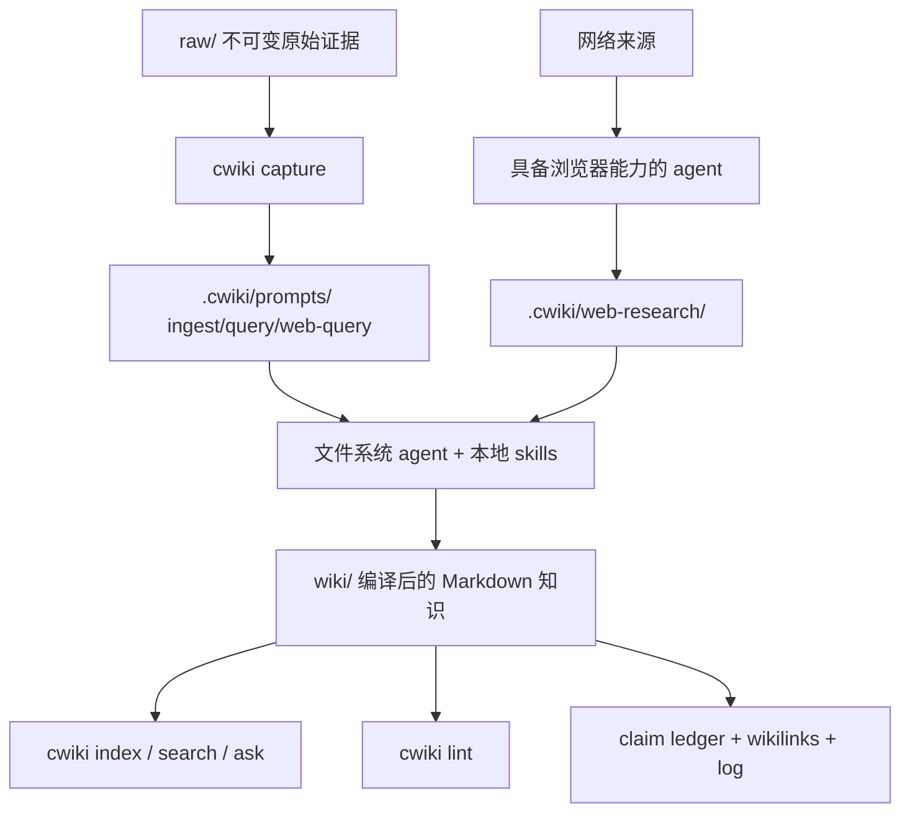

# LLM Compound Wiki

LLM Compound Wiki 是一套“AI 持续维护的复利型知识库”开源脚手架。

在任意文件夹里构建一个由 agent 持续维护的 Markdown wiki。

不需要数据库。不需要 embedding 服务。不绑定模型或平台。

可以配合 Codex、Claude Code、Cursor、Trae、OpenCode，或任何能读写文件系统的 agent 使用。

它参考了 Andrej Karpathy 提出的 `llm-wiki` 概念原型，也吸收了现有社区项目的 workflow 经验，但我们这版的定位更偏通用基础设施：

- 不绑定 Claude，Codex、Claude Code、OpenCode、Cursor 或其他能读写文件的 agent 都能使用
- 默认兼容 Obsidian 的 Markdown 和 `[[wikilink]]`
- 提供零依赖 Python CLI，能初始化、索引、搜索、捕获来源、健康检查
- 明确区分 `raw/` 原始证据和 LLM 完全拥有的 `wiki/` 编译知识层

## 为什么要做

传统 RAG 往往是在每次提问时重新检索、重新拼接、重新生成。LLM Compound Wiki 的思路是：让 AI 把知识“编译”成一个持续演化的 wiki。

每加入一个来源，agent 不只是保存它，而是：

- 提取可追踪的事实声明
- 更新相关主题页
- 添加双向链接
- 标注矛盾和不确定性
- 更新 `wiki/index.md`
- 追加 `wiki/log.md`

这样知识会累积，而不是散落在一次次对话里。



## 执行模型

LLM Compound Wiki 把确定性的本地工具层和智能 agent 层分开。

- CLI 是脚手架和本地工具层：初始化 wiki、捕获来源、重建索引、健康检查、搜索本地页面，以及生成可审计的 prompt 或 brief。
- 生成后的 wiki 文件夹是 agent 工作区。agent 修改 `wiki/` 前应先读取 `AGENTS.md`、`CLAUDE.md`、`WIKI_SCHEMA.md` 和本地 skills。
- 复制进去的 skill 文件是给 agent 读取的操作说明，不是 CLI 会自动执行的插件。
- `ask` 和 `web-ask` 只准备证据和 prompt，不调用大模型。
- `answer` 会调用 `.env` 配置的大模型，但只基于本地 wiki 检索。
- 实时联网研究目前需要具备浏览器能力的 agent 按 `wiki-agent-browser` 执行。

## 功能定位

| 能力 | LLM Compound Wiki |
|---|---|
| 不绑定具体 agent | 是 |
| 兼容 Obsidian Markdown | 是 |
| 零依赖 Python CLI | 是 |
| 不依赖 embedding 的本地搜索 | 是 |
| Claim Ledger 和操作日志 | 是 |
| 初始化后自带 agent skills | 是 |
| 托管知识库服务 | 否 |
| 需要向量数据库 | 否 |
| CLI 直接联网浏览 | 暂未实现 |
| 全自动爬虫 | 否 |

## 它不是什么

- 不是托管知识库应用。
- 不是向量数据库或 embedding 服务。
- 不是会静默重写 wiki 的全自动爬虫。
- 不绑定某个模型供应商、编辑器或 agent 平台。
- 不能替代人对“哪些来源值得沉淀为长期知识”的判断。

## 目录结构

```text
.
├── AGENTS.md                 本项目开发规则
├── bin/cwiki.py              零依赖 Python CLI
├── bin/cwiki.mjs             Node/npm 兼容包装器
├── templates/                初始化 wiki 时复制的模板
│   ├── AGENTS.md
│   ├── AGENTS.zh-CN.md
│   ├── CLAUDE.md
│   ├── CLAUDE.zh-CN.md
│   ├── WIKI_SCHEMA.md
│   ├── .claude/skills/       canonical skill 定义
│   └── .agents/skills/       兼容其他 agent 的入口
├── raw/                      用户私有原始材料，默认不进 git
├── .cwiki/prompts/           生成的 ingest 工作提示，默认不进 git
├── .cwiki/usage/             本地 LLM 用量台账，默认不进 git
├── wiki/
│   ├── overview.md           整个知识库的全局地图
│   ├── synthesis.md          跨来源综合结论
│   ├── summaries/            来源摘要和主题摘要
│   ├── entities/             人物、组织、产品、项目等实体
│   ├── concepts/             概念、方法、理论、术语
│   ├── comparisons/          对比、取舍和决策矩阵
│   ├── index.md              全库索引
│   └── log.md                追加式操作日志
```

## 快速开始

### 1. 克隆项目

```bash
git clone https://github.com/Forever5471/llm-compound-wiki.git
cd llm-compound-wiki
```

### 2. 创建一个 wiki

```bash
python3 ./bin/cwiki.py init ./my-wiki --domain "AI 研究笔记"
cd my-wiki
python3 ../bin/cwiki.py lint .
```

这会创建 `raw/`、`wiki/`、`.cwiki/prompts/`、`CLAUDE.md`、`CLAUDE.zh-CN.md`、`AGENTS.md`、`AGENTS.zh-CN.md`、`WIKI_SCHEMA.md`、`.env.example` 和 workflow skills。

### 3. 添加资料

可以直接把资料放到 `my-wiki/raw/`，也可以用 `capture` 捕获 URL 或本地文件：

```bash
python3 ../bin/cwiki.py capture . https://example.com/article --title "示例文章"
python3 ../bin/cwiki.py capture . ./notes.md --title "项目笔记"
python3 ../bin/cwiki.py capture . ./产品方案.docx --title "产品方案"
python3 ../bin/cwiki.py capture . ./介绍材料.pptx --title "介绍材料"
python3 ../bin/cwiki.py capture . ./指标表.xlsx --title "指标表"
```

`capture` 会把原始资料记录到 `raw/captures/`，并在 `.cwiki/prompts/` 下生成 ingest prompt。当前内置支持 URL 记录、UTF-8 文本/Markdown、`.docx`、`.pptx`、`.xlsx` 的 OOXML 文本抽取，以及图片文件引用记录；`.pdf` 会优先调用本机 `pdftotext`，如果环境没有该命令，会明确提示先转换为 UTF-8 文本或走图片/OCR流程。

复杂格式走项目内置解析 skill：`wiki-parse-docx`、`wiki-parse-pdf`、`wiki-parse-image`、`wiki-parse-pptx`、`wiki-parse-xlsx`。本项目不会自动去外部 GitHub 寻找或集成解析项目；如果内置解析效果不够好，建议用户先自行使用其他工具把原文件转换成 Markdown 或 UTF-8 文本，再用本项目继续 capture、ingest、ask、answer。

摄入时默认保留原文件语言：中文资料会生成中文 wiki 页面，英文资料会生成英文 wiki 页面。只有在用户明确要求时才翻译。

### 4. 让智能体摄入

用 Codex、Claude Code、OpenCode、Cursor 或其他能读写文件的 agent 打开生成的 wiki 目录，然后说：

```text
Read CLAUDE.md and WIKI_SCHEMA.md, then process .cwiki/prompts/ingest-xxx.md.
```

智能体应该把资料编译进：

```text
wiki/
├── overview.md
├── synthesis.md
├── summaries/
├── entities/
├── concepts/
├── comparisons/
├── index.md
└── log.md
```

### 5. 维护和搜索

```bash
python3 ../bin/cwiki.py index .
python3 ../bin/cwiki.py lint .
python3 ../bin/cwiki.py search . "retrieval"
python3 ../bin/cwiki.py ask . "这个 wiki 对 retrieval 有什么结论？"
python3 ../bin/cwiki.py web-ask . "这个主题最近有什么变化？" --wiki-weight 0.6 --web-weight 0.4
OPENAI_API_KEY=... python3 ../bin/cwiki.py answer . "这个 wiki 对 retrieval 有什么结论？"
```

## 可选 npm 包装器

如果仍然想要 npm 风格的全局 `cwiki` 命令，也可以安装；npm 入口只是转发到 Python：

```bash
npm install -g .
cwiki init ./my-wiki --domain "竞品研究"
cwiki search ./my-wiki "pricing"
cwiki lint ./my-wiki
```

仓库仍保留 `bin/cwiki.mjs` 作为 npm/Node 兼容包装器，但实际实现已经迁到 `bin/cwiki.py`。

依赖要求：

- Python 3.10+
- 只有在需要全局 `cwiki` 包装命令时才需要 Node/npm

## 命令

```bash
cwiki init <dir> [--domain "..."]
cwiki index <dir>
cwiki lint <dir>
cwiki graph <dir>
cwiki graph-report <dir>
cwiki path <dir> <from-slug-or-title> <to-slug-or-title>
cwiki explain <dir> <slug-or-title>
cwiki search <dir> <query>
cwiki ask <dir> <question> [--top-k 6] [--retrieval auto|direct|graph|path|synthesis] [--graph-rerank] [--show-context]
cwiki web-ask <dir> <question> [--top-k 6] [--max-web-sources 6] [--wiki-weight 0.6] [--web-weight 0.4] [--no-web] [--show-context]
cwiki answer <dir> <question> [--provider openai|glm] [--model "..."] [--top-k 6] [--retrieval auto|direct|graph|path|synthesis] [--graph-rerank]
cwiki eval <dir> [--output <file>] [--no-write] [--json]
cwiki eval-answer <dir> <answer-file> [--output <file>] [--no-write] [--json]
cwiki eval-all <dir> [--answer <answer-file>] [--wiki-only] [--output <file>] [--no-write] [--json]
cwiki eval-schedule <dir> --every-days 7 [--llm] [--run-if-due]
cwiki usage-report <dir> [--operation answer] [--artifact <path>] [--question "..."] [--json]
cwiki usage-log <dir> --operation ingest --provider agent-platform --model current-agent-model --input-tokens 1000 --output-tokens 500
cwiki capture <dir> <file-or-url> [--title "..."]
```

`capture` 不会假装自己已经理解了来源。它会把文件或 URL 捕获到 `raw/captures/`，并在 `.cwiki/prompts/` 里生成一份 ingest prompt。随后由 agent 按 `WIKI_SCHEMA.md` 和 `.agents/skills/` 的流程把来源编译进 `wiki/` 的合适分区。

`ask` 默认不会直接调用大模型。它会用混合检索搜索已经编译好的 wiki：关键词检索负责精确命中，轻量本地 hash 向量检索负责缓解同义词和长文本漏召回，关系检索会沿 `[[wikilink]]` 把相邻页面补进上下文。随后它在 `.cwiki/prompts/` 下生成给模型看的 query prompt，同时在 `.cwiki/briefs/` 下生成给人快速阅读的 evidence brief。brief 适合先粗看，prompt 适合交给 Codex、Claude Code 或其他 agent 生成完整答案。只有显式加 `--graph-rerank` 时，`ask` 才会调用 `.env` 或命令行配置的大模型，对 graph/path/synthesis 检索候选做语义重排。

这里的轻量向量检索不是 embedding API。它会把本地 Markdown 分词，把 token hash 到固定维度向量里，再用 cosine similarity、关键词分数和链接关系加权排序。它零依赖、确定性强，但语义能力不如真正的模型 embedding。

在 agent 平台里问答时，推荐使用混合式 query workflow：先用 `cwiki ask` 生成可复现的 evidence prompt 和 brief；agent 先读取这些产物和其中列出的 wiki 页面；如果 prompt 上下文不足，再主动搜索 wiki、读取相邻高价值页面，并沿相关 `[[wikilink]]` 追一层。最终回答仍应遵守项目协议：包含 `## Evidence Used`、`## Answer`、`## Gaps`，用 `[[slug]]` 引用 wiki 页面，并在事实附近保留 source path 或 URL。需要实时网络证据时，应切到 `cwiki web-ask` 和 `wiki-agent-browser`，而不是依赖模型记忆。

完整问答流程见 [docs/answering-workflow.zh-CN.md](docs/answering-workflow.zh-CN.md)。

`graph` 和 `graph-report` 会从已编译 wiki 的 frontmatter、Claim Ledger 和 `[[wikilink]]` 生成轻量图谱层。第一版不调用大模型，也不读取 `raw/` 正文：页面是 node，wikilink 是 edge，输出 `.cwiki/graph/graph.json` 和 `.cwiki/graph/graph.md`。`path` 用无向 wikilink 图查两个页面之间的最短路径，`explain` 展示一个页面的入链、出链、来源和度数。

`ask --retrieval auto|direct|graph|path|synthesis` 会基于这层图谱在 query prompt 中记录 Retrieval Trace：

- `direct`：直接关键词/向量命中，适合单点事实查询。
- `graph`：direct hits 加入入边/出边邻居，适合附近概念、角色、模块和相关实体。
- `path`：graph 上下文再加入最短路径证据，适合流程、机制、依赖、关系、how/why 类问题。
- `synthesis`：direct、graph、path、overview/synthesis 和中心节点一起进入上下文，适合综合总结、对比、取舍、策略和评估。
- `auto`：由 CLI 自动选择层级。若 `auto` 选中 `path` 但没有找到路径证据，会回退到 `graph`，并在 Retrieval Trace 中记录回退原因。

加 `--graph-rerank` 后，CLI 会把 final context candidates 的标题、摘要、来源角色、路径/邻居原因交给配置的大模型，让它返回严格 JSON 排序。重排状态、选中理由和 gaps 会写入 Retrieval Trace；`answer --graph-rerank` 会把重排后的 Context Pack 继续交给最终回答模型。GLM 图重排默认发送 `thinking: disabled`，让输出 token 优先用于严格 JSON；可用 `CWIKI_GRAPH_RERANK_THINKING=enabled` 改为推理模式。

`web-ask` 用于“本地 wiki + 实时网络资料”的问题。它会先做本地混合检索，再生成三类中间产物：`.cwiki/prompts/web-query-*.md` 负责浏览器研究任务，`.cwiki/web-research/web-research-*.md` 负责沉淀联网搜索结果，`.cwiki/prompts/fusion-*.md` 负责把本地 wiki 证据和 web 证据交给后续 agent 做综合性回答。默认权重是本地 wiki `0.6`、web search `0.4`；可以用 `--wiki-weight` 和 `--web-weight` 调整。`--web-weight 0` 或 `--no-web` 会关闭联网搜索，只生成本地 wiki-only 的融合 prompt。

当前实现里，CLI 本身不会直接联网浏览。复制到 `.claude/skills/` 和 `.agents/skills/` 的技能是给 agent 读取的操作说明，不是 CLI 会自动执行的插件。需要把生成的 `web-query-*.md` 交给具备浏览器/联网能力的 agent，并让它使用 `wiki-agent-browser`：先搜索并打开来源，把结果写入 `.cwiki/web-research/*.md`，再根据生成的 fusion prompt 综合回答。

未来可以增加一个纯终端的 `web-answer` 流程，把 wiki 检索、实时 web search、配置的证据权重和 `.env` 里的模型 provider 串成一个命令；但当前还没有实现。

具备浏览器/搜索能力的 agent 使用 `wiki-agent-browser` 时，应先读本地 wiki，再联网搜索，打开正文后再引用，并把搜索结果写入 `.cwiki/web-research/`。最终回答中要区分本地证据、网络证据、综合结论和缺口。每条外部事实都必须带 URL 和访问日期；值得长期保留的网页需要先 `cwiki capture . <url> --title "<title>"`，再摄入到 `wiki/`。

`answer` 会真正调用模型，并把草稿答案写到 `.cwiki/answers/`。目前支持 OpenAI Responses API 和 GLM OpenAI-compatible Chat Completions。它会先生成同样的 query prompt 和 human brief，因此答案可追溯。草稿答案不会自动写入 `wiki/`，建议人工确认后再让 agent 把有价值的综合沉淀进编译层。

`eval`、`eval-answer` 和 `eval-all` 会把质量报告写入 `.cwiki/eval/`。报告始终包含确定性本地检查和更细的质量信号。`eval-all` 默认扫描 `.cwiki/answers/` 并使用最新的 `answer-*.md` 生成综合报告；用 `--answer` 可以指定某个答案，用 `--wiki-only` 可以只评估 wiki。加 `--json` 时会输出适合 CI 或 agent 消费的结构化结果。

当希望 CLI 自己调用 `.env` 里配置的模型时，可以加 `--llm` 附加 LLM-assisted evaluation。报告会写清楚本次辅助评估使用的 provider、model、状态和时间；如果没有配置 API key，确定性评估仍会完成，LLM 部分标记为 `skipped`。

如果这个 wiki 正在 Trae、Codex、Claude Code、Cursor 等 agent 平台中使用，LLM-assisted interpretation 应使用该平台当前会话的模型，而不是项目 `.env` 中配置的模型。让 agent 先把辅助评估写成 Markdown 文件，再把它附加进正式报告：

```bash
cwiki eval-answer . .cwiki/answers/answer.md --agent-eval-file .cwiki/eval/agent-assisted-eval.md --agent-model "current-agent-model"
cwiki eval-all . --answer .cwiki/answers/answer.md --agent-eval-file .cwiki/eval/agent-assisted-eval.md --agent-model "current-agent-model"
```

报告会记录 `provider: agent-platform`、传入的模型名、时间戳和辅助评估来源文件。`cwiki eval-schedule . --every-days 7 --llm` 适合终端/CLI 模型评估；如果是 agent 平台周期任务，应让平台 automation 先运行确定性 eval，再用 `--agent-eval-file` 附加当前 agent 模型写出的辅助评估。

## LLM 用量与成本报告

只要 CLI 自己调用 `.env` 或命令行配置的大模型，就会把 token usage 和成本元数据记录到 `.cwiki/usage/llm-usage.jsonl`。当前自动覆盖这些环节：

- `answer`
- `ask --graph-rerank`
- `answer --graph-rerank`
- `eval --llm`、`eval-answer --llm`、`eval-all --llm`，以及开启 `--llm` 的 scheduled eval

成本只会基于你在 `.env` 中配置的单价估算，项目不会写死任何供应商价格。可以配置通用单价、provider 单价，或 provider+model 单价：

```bash
# 每 100 万 token 的价格
CWIKI_COST_INPUT_PER_1M=0
CWIKI_COST_OUTPUT_PER_1M=0
CWIKI_COST_GLM_INPUT_PER_1M=0
CWIKI_COST_GLM_OUTPUT_PER_1M=0
CWIKI_COST_GLM_GLM_4_6V_INPUT_PER_1M=0
CWIKI_COST_GLM_GLM_4_6V_OUTPUT_PER_1M=0
CWIKI_COST_CURRENCY=USD
```

生成完整报告：

```bash
cwiki usage-report .
```

也可以按环节、问题、产物、模型或时间窗口过滤：

```bash
cwiki usage-report . --operation answer
cwiki usage-report . --question "gray_zone"
cwiki usage-report . --artifact .cwiki/answers/answer-example.md
cwiki usage-report . --since 2026-05-18 --json
```

agent 平台不会自动把内部 token 计数暴露给这个 CLI。当 agent 使用当前平台模型做 ingest、update、浏览器研究、解释判断或外部辅助评估时，如果平台界面能看到 token 或费用，需要用 `usage-log` 补记：

```bash
cwiki usage-log . --operation ingest --provider agent-platform --model current-agent-model --input-tokens 12000 --output-tokens 1800 --estimated-cost 0.05 --currency USD --artifact wiki/synthesis.md
```

## 模型配置

初始化后的 wiki 会带有 `.env.example`。把它复制成项目目录或具体 wiki 目录下的本地 `.env`；`.env` 默认不进 git，适合放 API key：

```bash
CWIKI_PROVIDER=glm
CWIKI_GLM_MODEL=glm-4.6v
GLM_BASE_URL=https://open.bigmodel.cn/api/paas/v4
GLM_API_KEY=your-local-key

# OpenAI 可选默认值
CWIKI_OPENAI_MODEL=gpt-5.2
OPENAI_API_KEY=your-local-key

# 可选 graph rerank 默认值。
# 用于 `cwiki ask --graph-rerank` 和 `cwiki answer --graph-rerank`。
# 如果不设置，会复用 CWIKI_PROVIDER / CWIKI_MODEL。
# CWIKI_GRAPH_RERANK_PROVIDER=glm
# CWIKI_GRAPH_RERANK_MODEL=glm-4.6v
# CWIKI_GRAPH_RERANK_API_KEY_ENV=GLM_API_KEY
# CWIKI_GRAPH_RERANK_BASE_URL=https://open.bigmodel.cn/api/paas/v4
# CWIKI_GRAPH_RERANK_THINKING=disabled

# 可选 token 成本单价。数值含义是每 100 万 token 的价格；项目不会写死默认价格。
# CWIKI_COST_INPUT_PER_1M=0
# CWIKI_COST_OUTPUT_PER_1M=0
# CWIKI_COST_GLM_INPUT_PER_1M=0
# CWIKI_COST_GLM_OUTPUT_PER_1M=0
# CWIKI_COST_GLM_GLM_4_6V_INPUT_PER_1M=0
# CWIKI_COST_GLM_GLM_4_6V_OUTPUT_PER_1M=0
# CWIKI_COST_CURRENCY=USD

# web-ask 默认策略
CWIKI_WEB_WIKI_WEIGHT=0.6
CWIKI_WEB_WEIGHT=0.4
CWIKI_WEB_MAX_SOURCES=6
CWIKI_WEB_ENABLED=true
```

然后直接运行：

```bash
python3 ../bin/cwiki.py answer . "gray_zone是怎么设计的"
```

也可以在命令行临时覆盖：

```bash
python3 ../bin/cwiki.py answer . "gray_zone是怎么设计的" --provider glm --model glm-4.6v
```

`web-ask` 会读取这些 `.env` 默认值；命令行参数优先级更高。例如下面会临时覆盖 `.env`：

```bash
python3 ../bin/cwiki.py web-ask . "问题" --wiki-weight 0.8 --web-weight 0.2
python3 ../bin/cwiki.py web-ask . "问题" --no-web
```

### CLI 配置与 Agent 会话模型

`.env` 里的模型配置控制项目自身通过终端/CLI 执行的流程，例如 `cwiki answer`。`cwiki answer` 会使用配置的 provider/model 和本地 wiki 检索，但不会执行实时联网搜索。它不会改变 Trae、Codex、Claude Code、Cursor 或其他 agent 平台当前聊天会话选用的模型。

如果你让 agent 在初始化后的 wiki 文件夹中工作，最终文字通常由该 agent 当前启用的模型生成。agent 应先读取本地的 `CLAUDE.md`、`AGENTS.md` 和 `WIKI_SCHEMA.md`，优先使用 `.claude/skills/` 或 `.agents/skills/` 里的本地技能，并按这些本地流程完成 capture、ingest、query、update、lint 和 browser research。若本地技能不能覆盖本次任务，agent 可以再使用自己平台提供的工具或探索式实现，但仍应遵守 wiki schema 和来源引用规则。

在 agent 平台内回答 wiki 问题时，推荐路径是混合式：`cwiki ask` 负责生成稳定的 prompt 和 evidence brief，agent 再用当前会话模型回答；只有当 prompt 上下文不足时，才额外读取更多 wiki 页面。这样既保留可复现性，也避免 agent 被一次召回不足的 context pack 限死。

`.env` 里的 web 证据权重也不是 agent 内部隐藏的重排器。在 CLI 流程中，`cwiki web-ask` 会读取这些权重，并写入浏览器研究 prompt 和 fusion prompt；它不会自己执行浏览器研究。在 agent 流程中，agent 应按生成 prompt 里的权重或本地 wiki 指令，综合本地 wiki 证据和 web 证据。

## 页面规范

```markdown
---
title: Topic Name
kind: concept
tags: [tag-a, tag-b]
sources: 2
updated: 2026-05-08
status: active
---

# Topic Name

## Claim Ledger

| Claim | Source | Confidence | Last checked |
|---|---|---:|---|
| ... | raw/example.md | medium | 2026-05-08 |

## Synthesis

## Related

- [[another-topic]] - 关系说明

## Open Questions
```

这里的 `Claim Ledger` 是我们这版相对轻量模板的关键补强：每个事实声明都能追溯到来源，后续更新时不用整页重写。

## Agent 工作流

1. 改 wiki 前先读 `WIKI_SCHEMA.md`。
2. `raw/` 只读，作为证据层保存。
3. 按类型写入 `wiki/summaries/`、`wiki/entities/`、`wiki/concepts/`、`wiki/comparisons/`，并维护 `overview.md` 和 `synthesis.md`。
4. 事实声明必须有来源路径或 URL。
5. 每次 ingest 或 update 后都刷新 `wiki/overview.md` 和 `wiki/synthesis.md`，避免全局地图和综合结论停留在占位状态。
6. ingest 或保存分析后运行 `cwiki index .`。
7. 每隔几次 ingest 运行 `cwiki lint .`，处理断链、孤页和过期声明。

初始化后的 wiki 会同时生成 `CLAUDE.md`、`CLAUDE.zh-CN.md`、`AGENTS.md`、`AGENTS.zh-CN.md` 和 `WIKI_SCHEMA.md`。`CLAUDE.md` 是给 Claude Code 这类智能体看的强入口文件，`AGENTS.md` 是更通用的 agent 入口，`WIKI_SCHEMA.md` 是详细的 wiki 结构协议；两个 `.zh-CN.md` 文件是独立中文版入口，方便中文 agent 平台直接读取。

同时会生成 `wiki-init`、`wiki-capture`、`wiki-parse-docx`、`wiki-parse-pdf`、`wiki-parse-image`、`wiki-parse-pptx`、`wiki-parse-xlsx`、`wiki-ingest`、`wiki-query`、`wiki-agent-browser`、`wiki-update`、`wiki-lint` 等技能：`.claude/skills/` 里放 canonical 定义，`.agents/skills/` 里放兼容入口。

## 开源定位

这不是另一个封闭知识库产品，而是一套可 fork、可改、可放进 Obsidian、可被任意 agent 操作的文件系统协议。

MIT License
